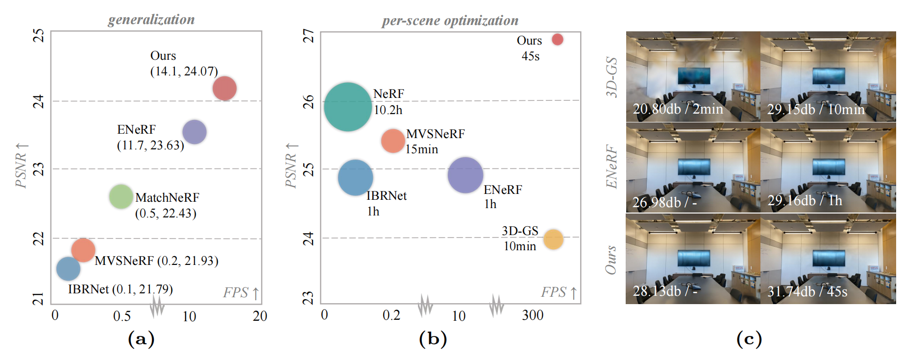

<h2 align="center" width="100%">
MVSGaussian: Fast Generalizable Gaussian Splatting Reconstruction from Multi-View Stereo
</h2>
<div>
<div align="center">
    <a href='http://tqtqliu.github.io/' target='_blank'>Tianqi Liu</a><sup>1</sup>&emsp;
    <a href='https://wanggcong.github.io/' target='_blank'>Guangcong Wang</a><sup>2,3</sup>&emsp;
    <a href='https://skhu101.github.io/' target='_blank'>Shoukang Hu</a><sup>2</sup>&emsp;
    <a href='https://leoshen917.github.io/' target='_blank'>Liao Shen</a><sup>1</sup><br>
    <a href='https://scholar.google.com/citations?user=g_Y0w7MAAAAJ' target='_blank'>Xinyi Ye</a><sup>1</sup>&emsp;
    <a href='https://yuhangzang.github.io/' target='_blank'>Yuhang Zang</a><sup>4</sup>&emsp;
    <a href='http://english.aia.hust.edu.cn/info/1085/1528.htm' target='_blank'>Zhiguo Cao</a><sup>1</sup>&emsp;
    <a href='https://weivision.github.io/' target='_blank'>Wei Li</a><sup>2</sup>&emsp;
    <a href='https://liuziwei7.github.io/' target='_blank'>Ziwei Liu</a><sup>2</sup>
</div>
<div>
<div align="center">
    <sup>1</sup>Huazhong University of Science and Technology&emsp;
    <sup>2</sup>Nanyang Technological University<br>
    <sup>3</sup>Great Bay University&emsp;
    <sup>4</sup>Shanghai AI Laboratory
</div>
    
<p align="center">
  <a href="https://arxiv.org/abs/2405.12218" target='_blank'>
    
  </a>
  <a href="https://mvsgaussian.github.io/" target='_blank'>
    
  </a>
  <a href="https://youtu.be/4TxMQ9RnHMA">
    
  </a>
  <a href="https://mp.weixin.qq.com/s/Y9uXxNMgliV9p-ne_bGpEw">
    
  </a>
   <a href="#">
    
  </a>
</p>

>**TL;DR**: <em>MVSGaussian is a Gaussian-based method designed for efficient reconstruction of unseen scenes from sparse views in a single forward pass. It offers high-quality initialization for fast training and real-time rendering.</em>
<div style="text-align:center">

</div>

## ⚡ Updates
+ [2024.07.16] The latest updated code supports multi-batch training (**[details](https://github.com/TQTQliu/MVSGaussian#-training)**) and inference, and **a single 3090 GPU** is sufficient to reproduce all of our experimental results.
+ [2024.07.16] Added a **[Demo (Custom Data)](https://github.com/TQTQliu/tmp?tab=readme-ov-file#-demo-custom-data)** that only requires multi-view images as input.
+ [2024.07.10] Code and checkpoints are released.
+ [2024.07.01] Our work is accepted by ECCV2024.
+ [2024.05.21] **[Project Page](https://mvsgaussian.github.io/)** |  **[arXiv](https://arxiv.org/abs/2405.12218)** | **[YouTube](https://youtu.be/4TxMQ9RnHMA)** released.


## 🌟 Abstract
We present MVSGaussian, a new generalizable 3D Gaussian representation approach derived from Multi-View Stereo (MVS) that can efficiently reconstruct unseen scenes.
Specifically, 1) we leverage MVS to encode geometry-aware Gaussian representations and decode them into Gaussian parameters. 2) To further enhance performance, we propose a hybrid Gaussian rendering that integrates an efficient volume rendering design for novel view synthesis. 3) To support fast fine-tuning for specific scenes, we introduce a multi-view geometric consistent aggregation strategy to effectively aggregate the point clouds generated by the generalizable model, serving as the initialization for per-scene optimization. Compared with previous generalizable NeRF-based methods, which typically require minutes of fine-tuning and seconds of rendering per image, MVSGaussian achieves real-time rendering with better synthesis quality for each scene. Compared with the vanilla 3D-GS, MVSGaussian achieves better view synthesis with less training computational cost. Extensive experiments on DTU, Real Forward-facing, NeRF Synthetic, and Tanks and Temples datasets validate that MVSGaussian attains state-of-the-art performance with convincing generalizability, real-time rendering speed, and fast per-scene optimization. 
<div style="text-align:center">

</div>


## 🔨 Installation
+ Clone our repository

  ```
  git clone https://github.com/TQTQliu/MVSGaussian.git
  cd MVSGaussian
  ```

+ Set up the python environment

  ```
  conda create -n mvsgs python=3.7.13
  conda activate mvsgs
  pip install -r requirements.txt
  pip install torch==1.13.1+cu116 torchvision==0.14.1+cu116 torchaudio==0.13.1 -f https://download.pytorch.org/whl/torch_stable.html
  ```

+ Install [Gaussian Splatting](https://github.com/graphdeco-inria/gaussian-splatting) renderer
  ```
  git clone https://github.com/graphdeco-inria/gaussian-splatting --recursive
  pip install gaussian-splatting/submodules/diff-gaussian-rasterization
  pip install gaussian-splatting/submodules/simple-knn
  ```


## 🤗 Demo (Custom Data)

  First, prepare the multi-view image data, and then run colmap. Here, we take `examples/scene1` ([examples data](https://drive.google.com/drive/folders/1S-Ke5ZI3tfNpuSkumJ1R7LFbb_I8oArD?usp=sharing)) as an example:
  ```
  python lib/colmap/imgs2poses.py -s examples/scene1
  ```
  And execute the following command to obtain novel views:
  ```
  python run.py --type evaluate --cfg_file configs/mvsgs/colmap_eval.yaml test_dataset.data_root examples/scene1
  ```
  or videos:
  ```
  python run.py --type evaluate --cfg_file configs/mvsgs/colmap_eval.yaml test_dataset.data_root examples/scene1 save_video True
  ```
## 📦 Datasets

+ DTU

  Download [DTU data](https://drive.google.com/file/d/1eDjh-_bxKKnEuz5h-HXS7EDJn59clx6V/view) and [Depth raw](https://virutalbuy-public.oss-cn-hangzhou.aliyuncs.com/share/cascade-stereo/CasMVSNet/dtu_data/dtu_train_hr/Depths_raw.zip). Unzip and organize them as:
  ```
  mvs_training
      ├── dtu                   
          ├── Cameras                
          ├── Depths   
          ├── Depths_raw
          └── Rectified
  ```

+ Download [NeRF Synthetic](https://drive.google.com/drive/folders/1WAeA7-Ktr9-sFDmoNYgmL3wt8Ltm7-Ys?usp=sharing), [Real Forward-facing](https://drive.google.com/drive/folders/1rciqkjLQEBnoT3lrXWfsJW3s3dHdrV9e?usp=sharing), and [Tanks and Temples](https://drive.google.com/drive/folders/15Q-N5SrD96i3YmQv0EgmzwJj80IBeYhQ?usp=sharing) datasets.


## 🚂 Training
+ Train generalizable model

  To train a generalizable model from scratch on DTU, specify ``data_root`` in ``configs/mvsgs/dtu_pretrain.yaml`` first and then run:
  ```
  python train_net.py --cfg_file configs/mvsgs/dtu_pretrain.yaml train.batch_size 4
  ```
  You can specify the `gpus` in `configs/mvsgs/dtu_pretrain.yaml`.

  Our code also supports multi-gpu training. The released pretrained model (paper) was trained with 4 RTX 3090 GPUs with a batch size of 1 for each GPU:
  ```
  python -m torch.distributed.launch --nproc_per_node=4 train_net.py --cfg_file configs/mvsgs/dtu_pretrain.yaml distributed True gpus 0,1,2,3 train.batch_size 1
  ```
  You can also use 4 GPUs, with a batch size of 4 for each GPU:
  ```
  python -m torch.distributed.launch --nproc_per_node=4 train_net.py --cfg_file configs/mvsgs/dtu_pretrain.yaml distributed True gpus 0,1,2,3 train.batch_size 4
  ```
  We provide the results as a **reference** below:

  <table>
  <tr>
    <th align="center" rowspan=2>GPU number</th>
    <th align="center" rowspan=2>Batch size</th>
    <th align="center" colspan=3>DTU</th>
    <th align="center" colspan=3>Real Forward-facing</th>
    <th align="center" colspan=3>NeRF Synthetic</th>
    <th align="center" colspan=3>Tanks and Temples</th>
    <th align="center" rowspan=2>Training time (per epoch)</th>
    <th align="center" rowspan=2>Training memory </th>
    <th align="center" rowspan=2>Checkpoint</th>
  </tr>
  <tr>
    <th align="center">PSNR</th>
    <th align="center">SSIM</th>
    <th align="center">LPIPS</th>
    <th align="center">PSNR</th>
    <th align="center">SSIM</th>
    <th align="center">LPIPS</th>
    <th align="center">PSNR</th>
    <th align="center">SSIM</th>
    <th align="center">LPIPS</th>
    <th align="center">PSNR</th>
    <th align="center">SSIM</th>
    <th align="center">LPIPS</th>
  </tr>
  <tr>
    <td align="center">1</td>
    <td align="center">4</td>
    <td align="center">28.23</td>
    <td align="center">0.963</td>
    <td align="center">0.075</td>
    <td align="center">24.19</td>
    <td align="center">0.860</td>
    <td align="center">0.164</td>
    <td align="center">26.57</td>
    <td align="center">0.948</td>
    <td align="center">0.070</td>
    <td align="center">23.50</td>
    <td align="center">0.879</td>
    <td align="center">0.137</td>
    <td align="center">~12min</td>
    <td align="center">~22G</td>
    <td align="center"><a href="https://drive.google.com/drive/folders/16mzCq00juiPTntvZ5clt6P117VQfN84o?usp=sharing">1gpu_4batch</a></td>
  </tr>
  <tr>
    <td align="center">4</td>
    <td align="center">1</td>
    <td align="center">28.21</td>
    <td align="center">0.963</td>
    <td align="center">0.076</td>
    <td align="center">24.07</td>
    <td align="center">0.857</td>
    <td align="center">0.164</td>
    <td align="center">26.46</td>
    <td align="center">0.948</td>
    <td align="center">0.071</td>
    <td align="center">23.29</td>
    <td align="center">0.878</td>
    <td align="center">0.139</td>
    <td align="center">~5min</td>
    <td align="center">~7G</td>
    <td align="center"><a href="https://drive.google.com/drive/folders/1to-JNQHP5wU3ux7m6sZKS6tSmfgGLviT?usp=sharing">4gpu_1batch (paper)</a></td>
  </tr>
  <tr>
    <td align="center">4</td>
    <td align="center">4</td>
    <td align="center">28.56</td>
    <td align="center">0.964</td>
    <td align="center">0.073</td>
    <td align="center">24.02</td>
    <td align="center">0.858</td>
    <td align="center">0.165</td>
    <td align="center">26.28</td>
    <td align="center">0.947</td>
    <td align="center">0.072</td>
    <td align="center">23.14</td>
    <td align="center">0.876</td>
    <td align="center">0.147</td>
    <td align="center">~14min</td>
    <td align="center">~23G</td>
    <td align="center"><a href="https://drive.google.com/drive/folders/1lvXz6dP1NlVQEx5vvnGRcqaiWHnjVc_X?usp=sharing">4gpu_4batch</a></td>
  </tr>
</table>
  
+ Per-scene optimization

  One strategy is to optimize only the initial Gaussian point cloud provided by the generalizable model.

   ```
  bash scripts/mvsgs/llff_ft.sh
  bash scripts/mvsgs/nerf_ft.sh
  bash scripts/mvsgs/tnt_ft.sh
  ```
  We provide optimized Gaussian point clouds for each scenes [here](https://drive.google.com/drive/folders/1553NgVLcahuAp4GNoTBgi9IKa0ADuvpC?usp=sharing).

  You can also run the following command to get the results of vanilla 3D-GS, whose initialization is obtained via COLMAP.
  ```
  bash scripts/3dgs/llff_ft.sh
  bash scripts/3dgs/nerf_ft.sh
  bash scripts/3dgs/tnt_ft.sh
  ```

  It is worth noting that for the LLFF dataset, the point cloud in the original dataset is obtained by using all views. For fair comparison, we only use the training view set to regain the point cloud, so we recommend downloading the [LLFF dataset we processed](https://drive.google.com/drive/folders/1rciqkjLQEBnoT3lrXWfsJW3s3dHdrV9e?usp=sharing).


  (Optional) Another approach is to optimize the entire pipeline, similar to NeRF-based methods.

  Here we take the `fern` on the LLFF as an example:
  ```
  cd ./trained_model/mvsgs
  mkdir llff_ft_fern
  cp dtu_pretrain/latest.pth llff_ft_fern
  cd ../..
  python train_net.py --cfg_file configs/mvsgs/llff/fern.yaml
  ```

## 🎯 Evaluation

+ Evaluation on DTU

  Download the [pretrained model](https://drive.google.com/drive/folders/1Eh2hREvZud6aJ7Rer2HoFTnQTUR3img7?usp=sharing) and put it into `trained_model/mvsgs/dtu_pretrain/latest.pth`

  Use the following command to evaluate the pretrained model on DTU:
  ```
  python run.py --type evaluate --cfg_file configs/mvsgs/dtu_pretrain.yaml mvsgs.cas_config.render_if False,True mvsgs.cas_config.volume_planes 48,8 mvsgs.eval_depth True
  ```
  The rendered images will be saved in ```result/mvsgs/dtu_pretrain```. 

+ Evaluation on Real Forward-facing

  ```
  python run.py --type evaluate --cfg_file configs/mvsgs/llff_eval.yaml
  ```

+ Evaluation on NeRF Synthetic

  ```
  python run.py --type evaluate --cfg_file configs/mvsgs/nerf_eval.yaml
  ```

+ Evaluation on Tanks and Temples

  ```
  python run.py --type evaluate --cfg_file configs/mvsgs/tnt_eval.yaml
  ```
+ Render videos

  Add the ```save_video True``` argument to save videos, such as:
  ```
  python run.py --type evaluate --cfg_file configs/mvsgs/llff_eval.yaml save_video True
  ``` 

  For optimized Gaussians, add `-v` to save videos, such as:
  ```
  python lib/render.py -m output/$scene -p $dir_ply -v
  ``` 
  See `scripts/mvsgs/nerf_ft.sh` for `$scene` and `$dir_ply`.


## 📝 Citation
If you find our work useful for your research, please cite our paper.

```
@article{liu2024mvsgaussian,
    title={MVSGaussian: Fast Generalizable Gaussian Splatting Reconstruction from Multi-View Stereo},
    author={Liu, Tianqi and Wang, Guangcong and Hu, Shoukang and Shen, Liao and Ye, Xinyi and Zang, Yuhang and Cao, Zhiguo and Li, Wei and Liu, Ziwei},
    journal={arXiv preprint arXiv:2405.12218},
    year={2024}
}
```

## 😃 Acknowledgement
This project is built on source codes shared by [Gaussian-Splatting](https://github.com/graphdeco-inria/gaussian-splatting), [ENeRF](https://github.com/zju3dv/enerf/), [MVSNeRF](https://github.com/apchenstu/mvsnerf) and [LLFF](https://github.com/Fyusion/LLFF). Many thanks for their excellent contributions!

## 📧 Contact
If you have any questions, please feel free to contact Tianqi Liu <b>(tq_liu at hust.edu.cn)</b>.
